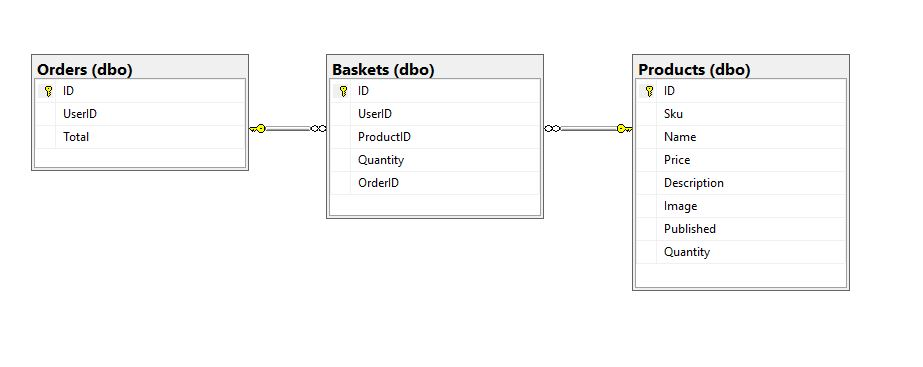

# E-Commerce Application
.NET Core E-Commerce application.

### Demo
[https://ecomcupcake.azurewebsites.net](https://ecomcupcake.azurewebsites.net)
### Objective
Create our own platform for selling Cupcakes.

###Project Structure
The project will be broken up into 3  sprints. Each sprint consists of 4 or 5 days.

Sprints will be week long including weekly check-in.

###What is an E-Commerce Store?
E-Commerce store is a platform for doing commercial transactions electronically over the internet. We use E-commerce sites all the time. Amazon and Ebay are perfect examples of ecommerce sites that are extremely popular today.

###Product
We are Selling Cupcakes.

###Claims
The following claims are captured:
- State
- Email
- Full Name

The following claims are needed to create policies for Administrators, as well as for when information required to purchase products (Checkout Page) is captured.

###Policies
- We are enforcing the Admin policy to restrict access to inventory management pages to Administrators.
- Pages accessible for admins only:
  - https://ecomcupcake.azurewebsites.net/Inventory/index
  - https://ecomcupcake.azurewebsites.net/Inventory/create
  - https://ecomcupcake.azurewebsites.net/Inventory/edit
  - https://ecomcupcake.azurewebsites.net/Inventory/delete

### OAUTH providers
- Microsoft
- Facebook

#Database Schema

- Products: Contains products that we have for sale.
- Orders: Completed order by customer.
- Baskets: Items in basket and items that were part of a previous order.

The Baskets contain a nullable OrderID field which indicates wheter a basket item is part of a completed order. Once a order is placed and the basket items have that order id, the users basket will be empty, but the items will still be in our table so that we have a record.